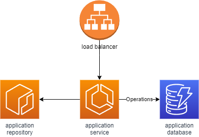

## ECS - Create a ECS cluster and GRPC service with an ALB and DynamoDB connection

### Objectives

1. Create a GRPC application that uses DynamoDB as its primary DB
   1. Should have a basic crud
   2. Should be dockerized
2. Create a DynamoDB with the following characteristics
   1. Table should be on demand
   2. Throughput should be the dominant cost
   3. Encryption is managed by AWS
   4. Partition and sort key should be the ones defined by the application
3. Create an ECS cluster with the following characteristics
   1. Should have Fargate and Fargate spot as capacity provider
4. Create an ECS service with the following characteristics
   1. Use the dockerized GRPC service
   2. Store the code in ECR
   3. Should be connected to an ALB with GRPC configuration
   4. Should use target tracking autoscaling

The general architecture should look like this

