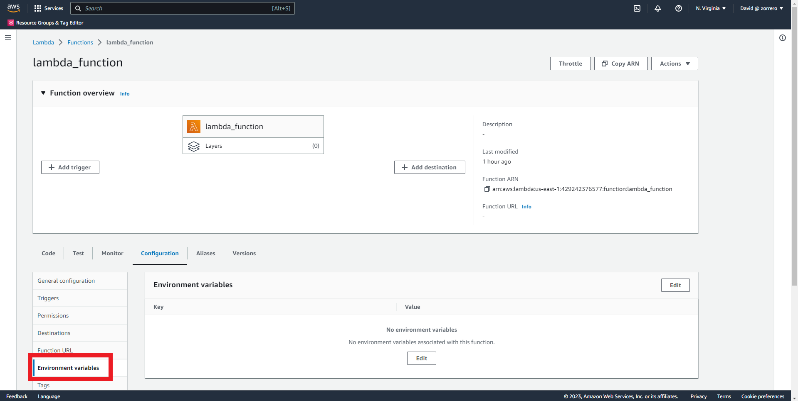
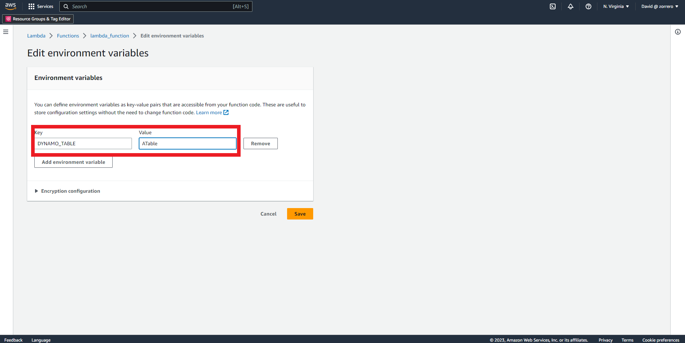

## Computing AWS - Create a Lambda function with proxy API Gateway and DynamoDB database

### Solution

1. Go to S3 dashboard and click on "Create bucket" 
2. Fill the bucket name and leave every thing else as default 
3. Click on "Create bucket" 
4. Enter the created bucket and upload the code 
5. Go to Lambda dashboard and click on "Create function" 
6. Fill the function name and leave every thing else as default, in this case python 3.9 is selected for code 
7. Click on "Create function" 
8. Click on "Upload from" and select the "Amazon S3 location" option 
9. Fill with the S3 URi of your function code 
10. Click on Actions and "Publish new version" 
11. Click on "Publish" 
12. Go back to your function and click on Aliases tab the option "Create Alias" 
13. Fill the name and point to the version just published 
14. Click on "Save" 
15. Enter the DynamoDB dashboard and click on create table  
16. Enter the table name 
17. Enter the partition key, in this case no sort key will be used  
18. Click on customize settings and table class Standard 
19. Select "On-demand" for read/write 
20. Leave the rest as default and click "Create Table" 
21. Go to the IAM console and modify your lambda_function role and click on "Add permissions"  
22. Select inline policy and "DynamoDB" as service 
23. Select GetItem and PutItem in actions 
24. In resources add the new DynamoDB table ARN to restrict access 
25. Click on "review policy" 
26. Give the policy a name 
27. Click on "Create policy" 
28. Go to API Gateway dashboard and click on "Create API" 
29. Select HTTP API 
30. Fill the api name and click on "Review and Create" 
31. Click on "Create" 
32. Go to Stages 
33. Click on "Create" 
34. Fill the name and enable auto deployment 
35. Click on "Create" 
36. Go to Routes and click on "Create" 
37. Let ANY on method and /events/{proxy+} For the route 
38. Click on "Create" 
39. Go to Integrations and click on "Manage integrations" 
40. Click on "Create" 
41. Select the created route 
42. Select "Lambda function" as integration target 
43. Add the alias ARN 
44. Click on "Create" 

Be aware that provided code requires the dynamo table to be an environment variable
1. Go to Lambda function configuration 
2. Go to environment variables 
3. Click on edit 
4. Click on "Add environment variable" 
5. Fill the information 
6. Click on "Save" 