## Computing AWS - Create a Lambda function with origin in SNS Topic and destination in SQS

### Solution

1. Enter SQS Dashboard and click "Create queue" 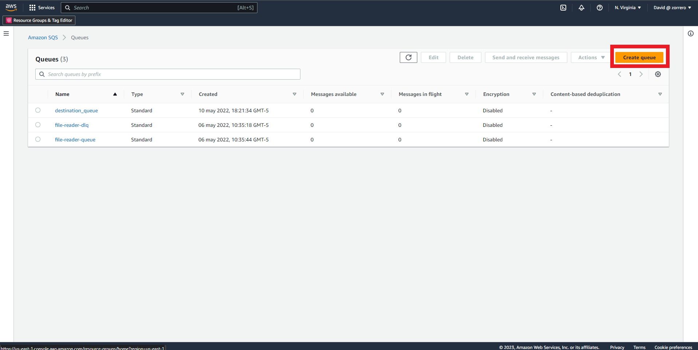
2. Fill the queue name and leave every thing else as default 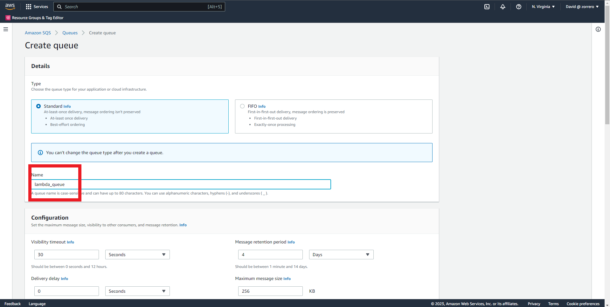
3. Click "Create queue" 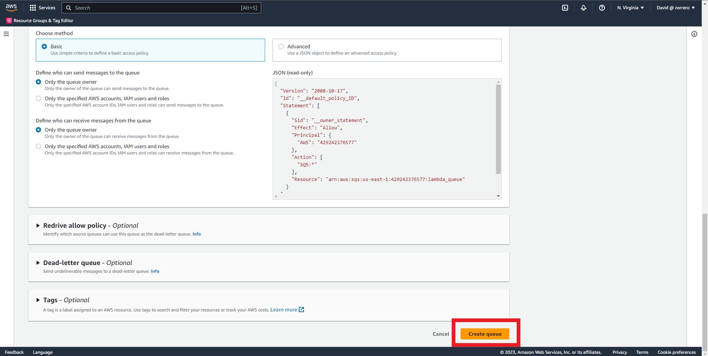
4. Go to SNS Dashboard and click on "Topics" 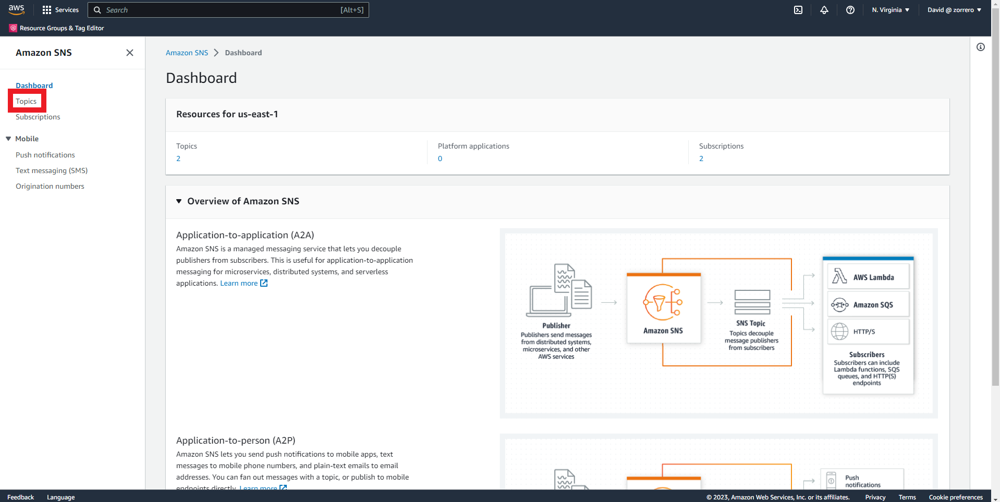
5. Click on "Create topic" 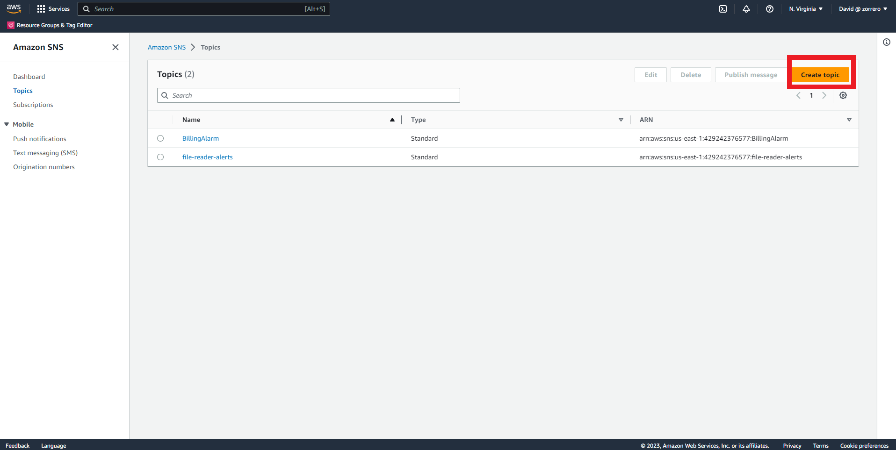
6. Select standard and fill the topic name, leave every thing else as default 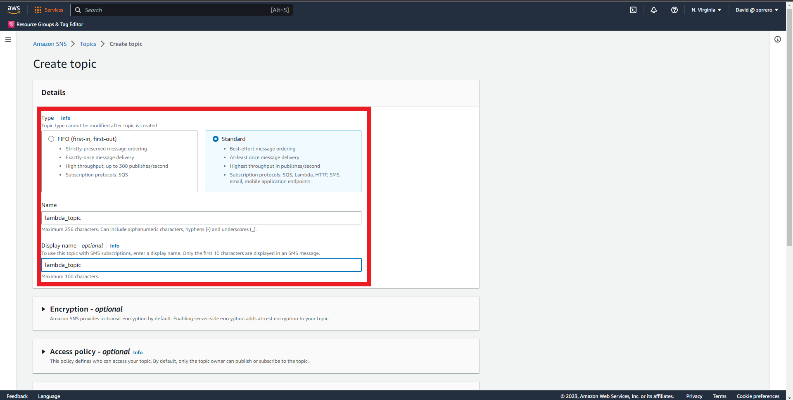
7. Click on "Create topic" 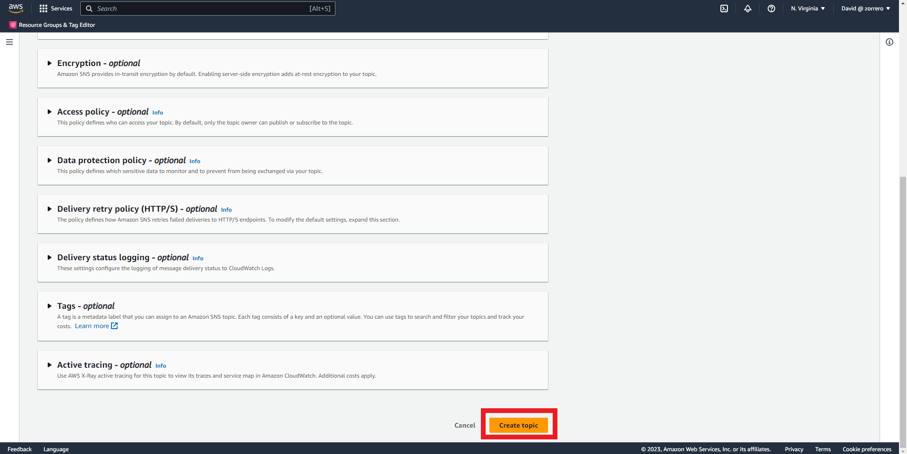
8. Go to S3 dashboard and click on "Create bucket" 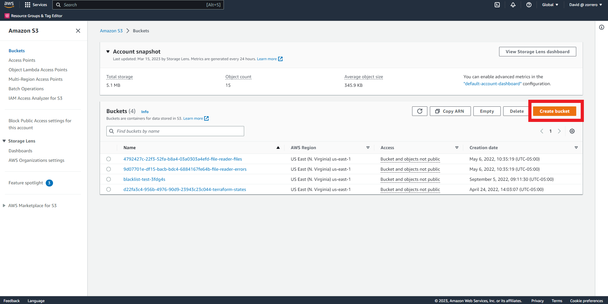
9. Fill the bucket name and leave every thing else as default 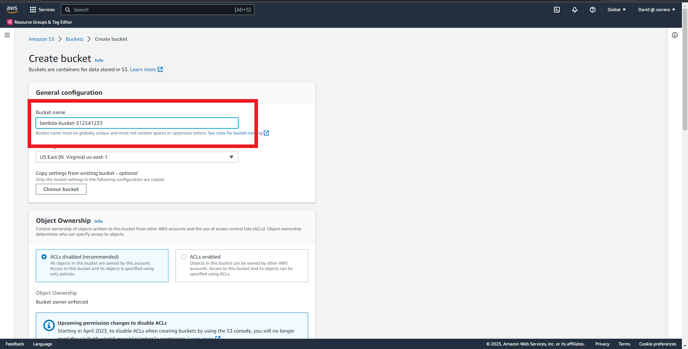
10. Click on "Create bucket" 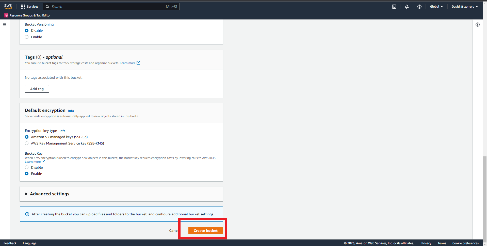
11. Enter the created bucket and upload the code 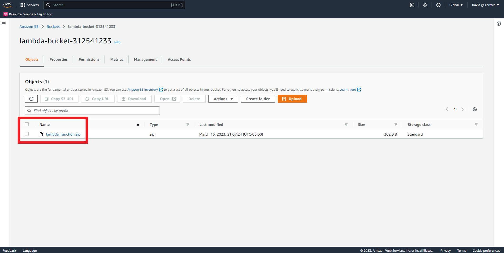
12. Go to Lambda dashboard and click on "Create function" 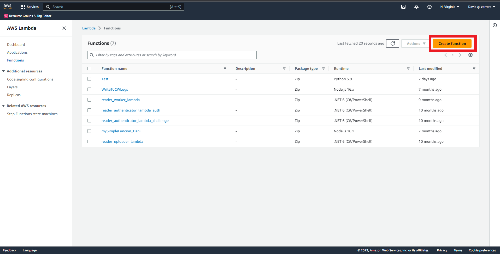
13. Fill the function name and leave every thing else as default, in this case python 3.9 is selected for code 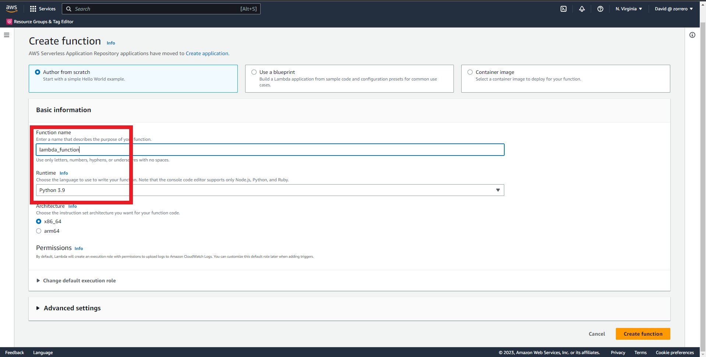
14. Click on "Create function" 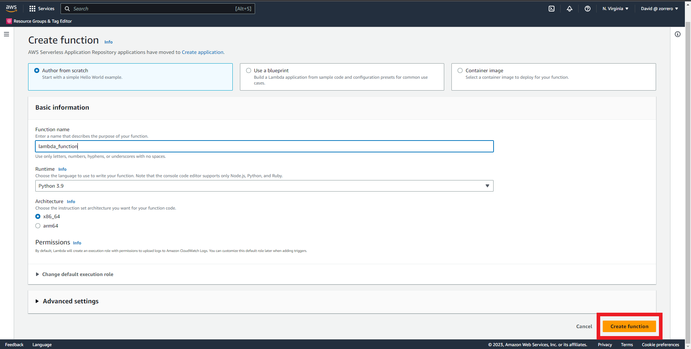
15. Click on "Upload from" and select the "Amazon S3 location" option 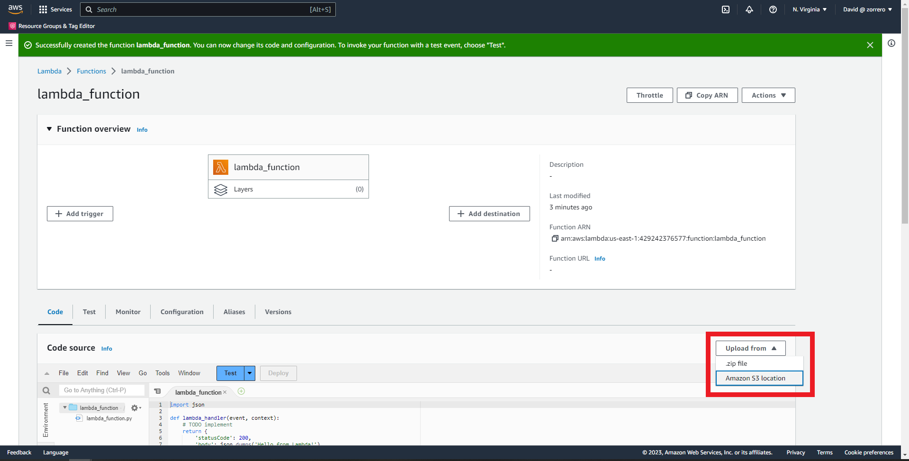
16. Fill with the S3 URi of your function code 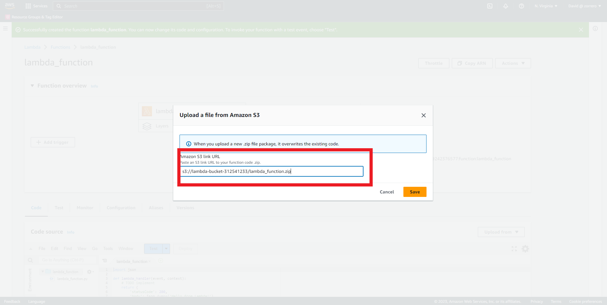
17. Click on "Add trigger" and fill with the SNS topic 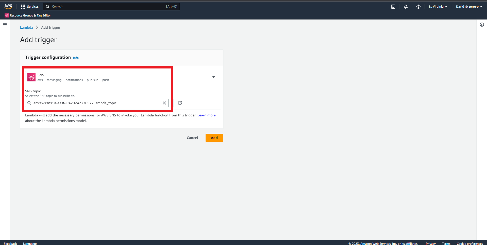
18. Click on "Add destination" and fill "On success" and "Asynchronous invocation" with the SQS queue 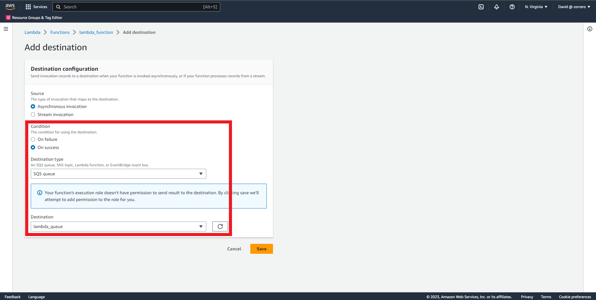