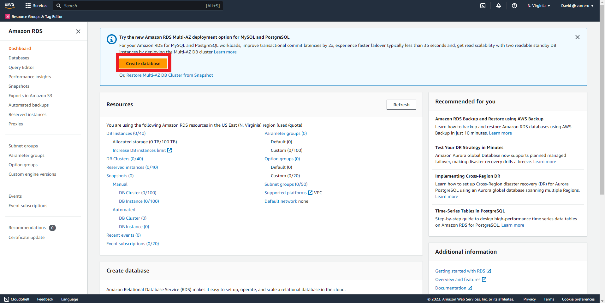
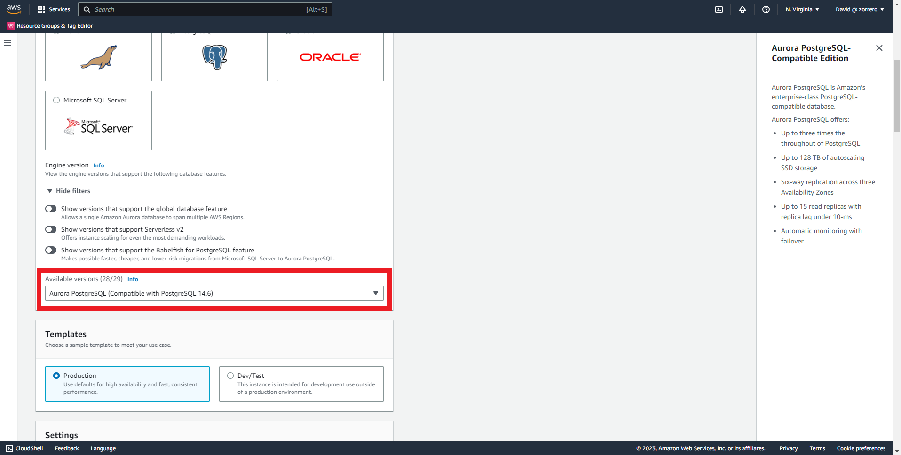
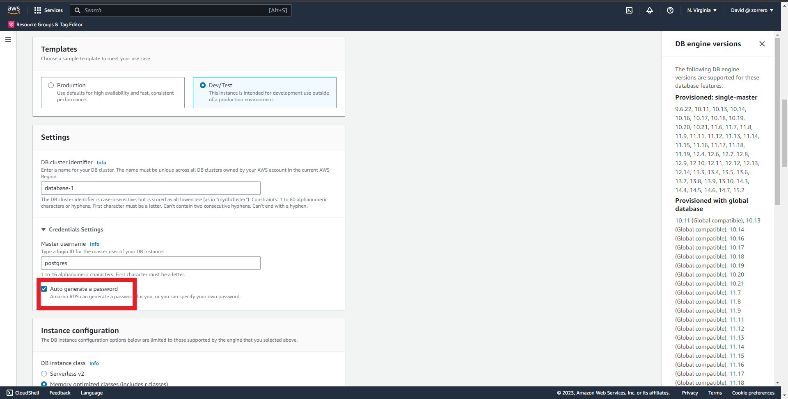
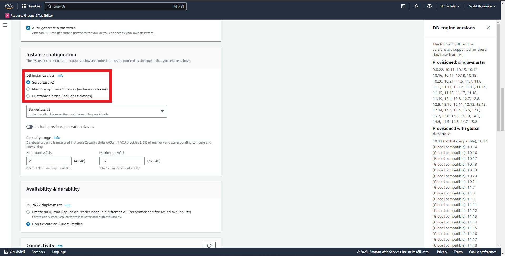
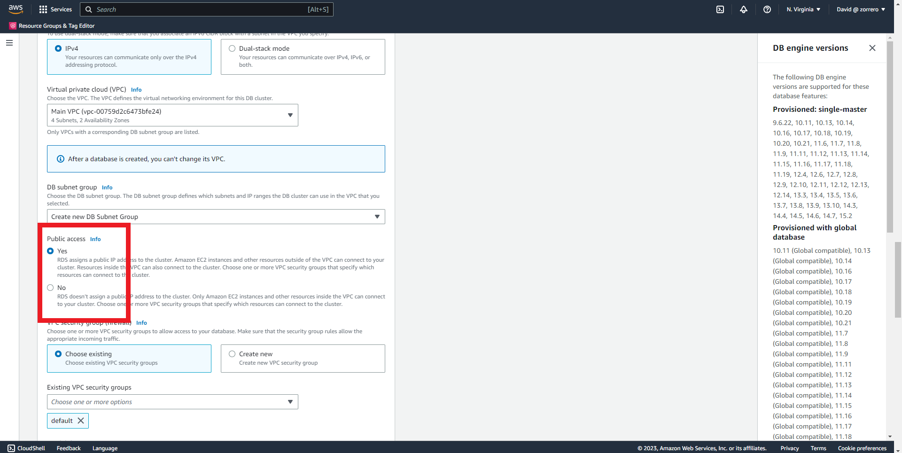
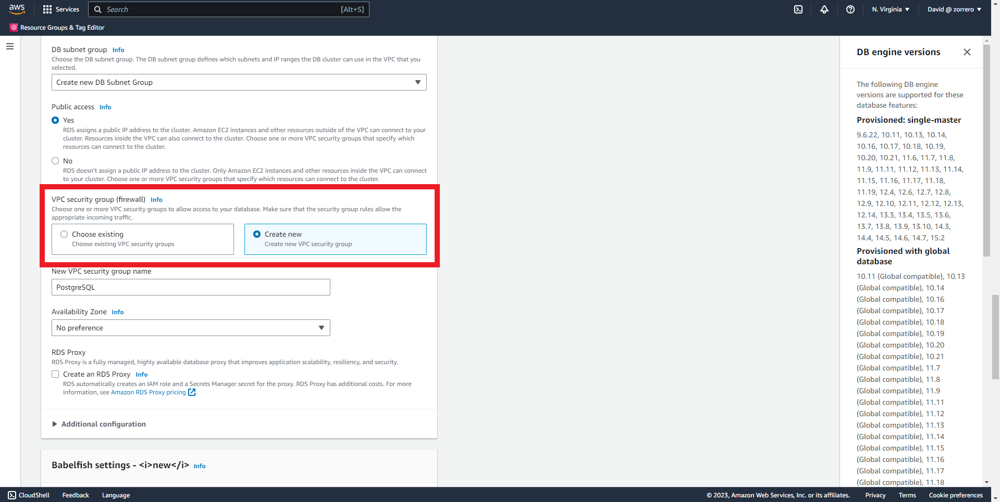

## Aurora - Create a Aurora cluster

### Solution

1. Enter to RDS dashboard and click on "Create database" 
2. Select "Aurora (PostgreSQL Compatible)" 
3. Select "Aurora PostgreSQL (Compatible with PostgrSQL 14.6)" 
4. As this is a dev database select "Dev/Test" template 
5. Click on "Auto generate password" 
6. Click on "Serverless V2" 
7. Set the ACUs to 0.5 and 4 in min/max 
8. Select "Yes" for public access, be sure that your VPC has "DNS resolution" and "DNS hostnames" enabled 
9. Click on "Create new" in security groups 
10. Click on "Create database" 