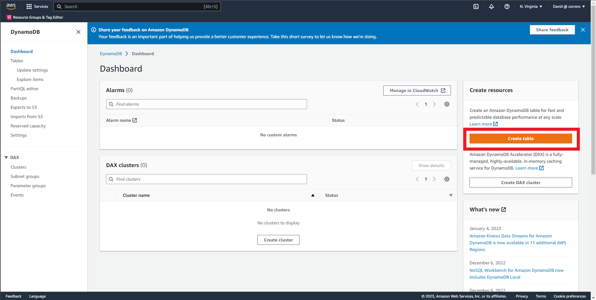
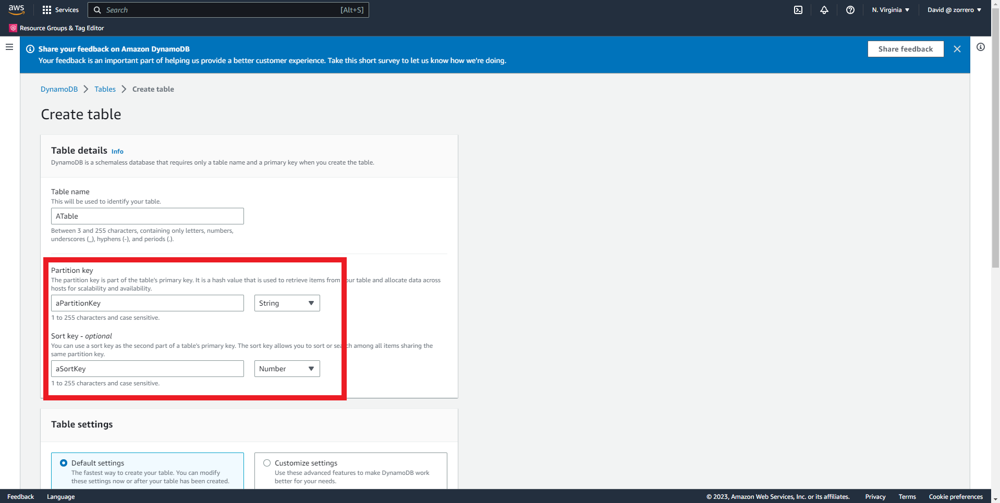
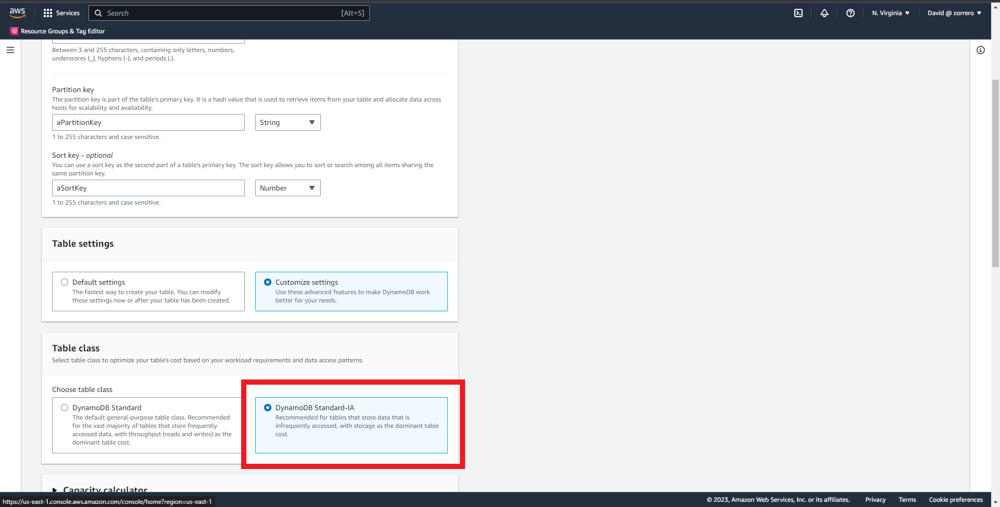
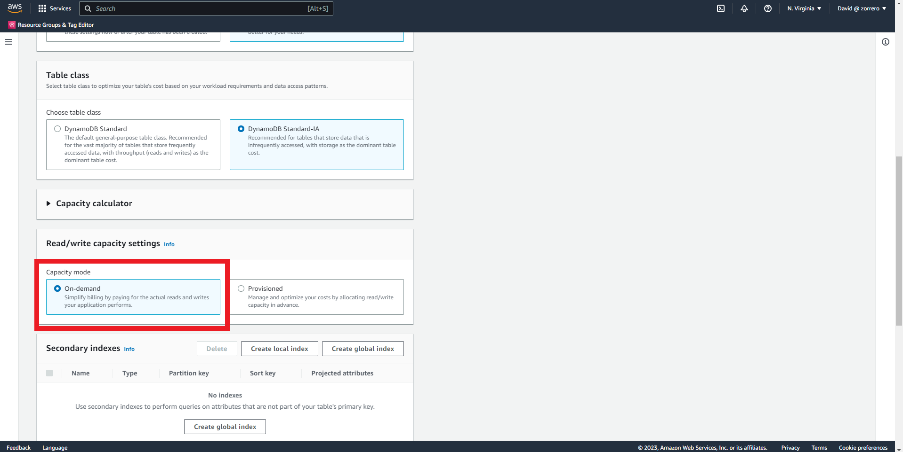
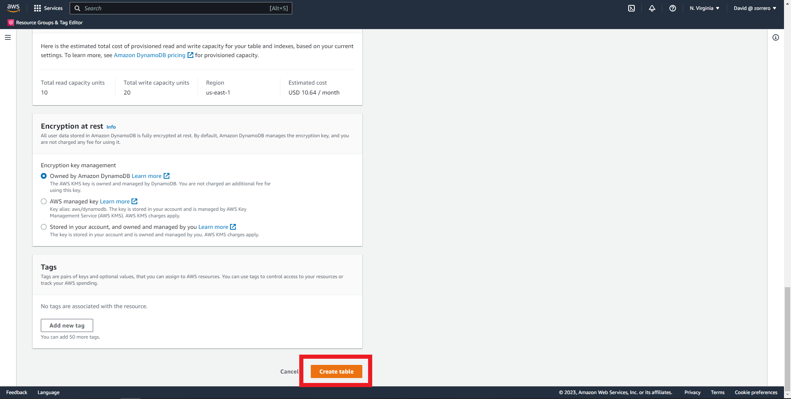

## Databases AWS - Create a on demand DynamoDB table

### Solution

1. Enter the DynamoDB dashboard and click on create table 
2. Enter the table name 
3. Fill the partition key and sort key, select number for the sort key 
4. Select customized settings and Standard-IA 
5. Select on demand in capacity mode 
6. Leave encryption by default and click on create table 