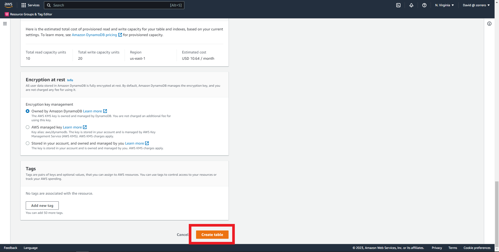

## Databases AWS - Create a provisioned DynamoDB table

### Solution

1. Enter the DynamoDB dashboard and click on create table 
2. Enter the table name 
3. Fill the partition key and sort key, select number for the sort key 
4. Select customize settings, leave it as standard 
5. Fill the values for average item size, read/second, write/second, read consistency and write consistency 
6. Disable autoscaling, as there will be no changes in requirements, then provision the units with the calculator output 
7. Leave encryption by default and click on create table 