## MemoryDB - Create a public MemoryDB database

### Solution

1. Go to MemoryDB dashboard and click on "Create a cluster" 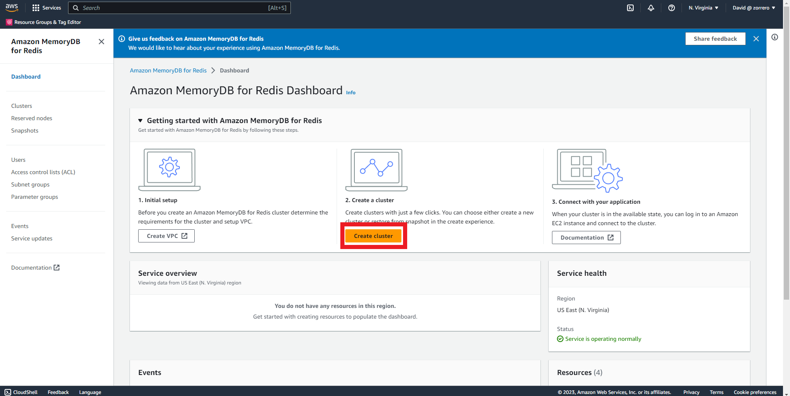
2. Fill the name 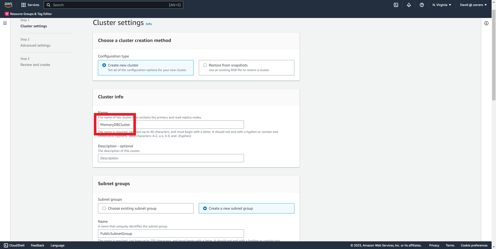
3. Fill the name with the new subnet group name 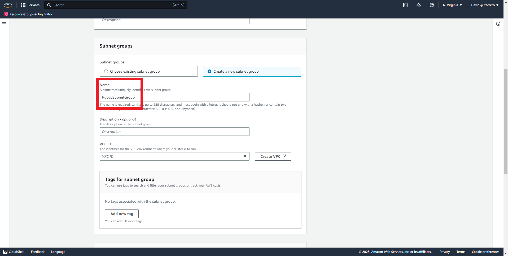
4. Choose your VPC 
5. Click on "Manage" in selected subnets 
6. Add your public subnets and click on "Choose" 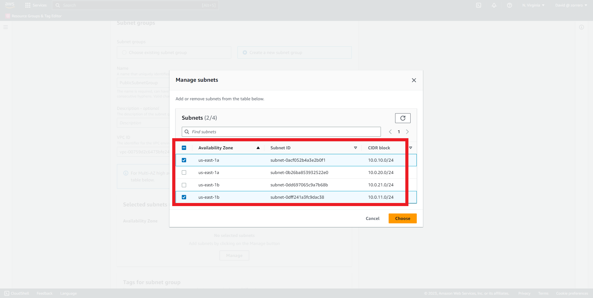
7. Set the node type 
8. Select 2 as the number of shards 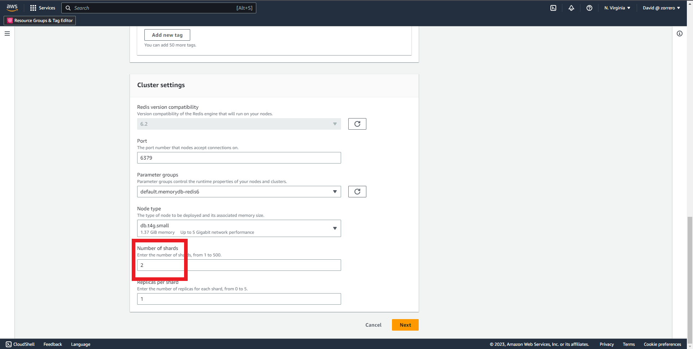
9. Click on "Next" 
10. Click on "Manage" in security groups 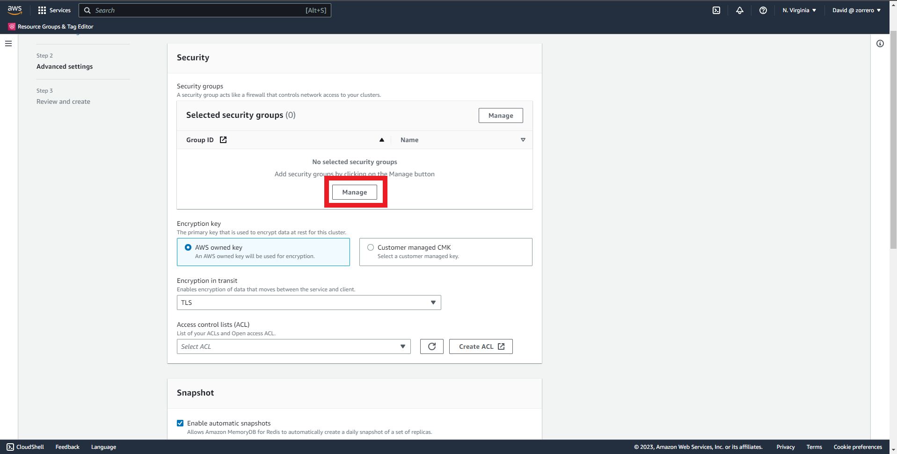
11. Select your security groups and click on "Choose" 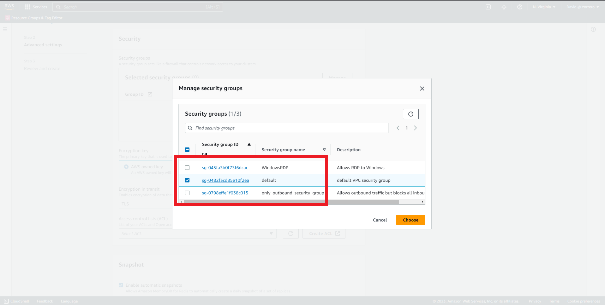
12. Click on "Create ACL" 
13. Fill the name field 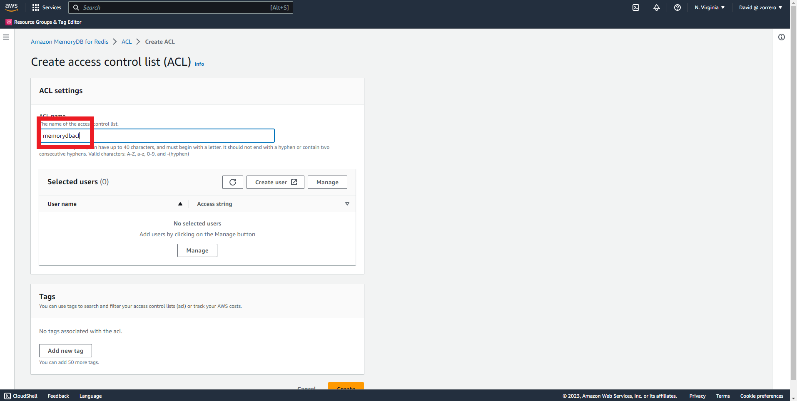
14. Click on "Create user" 
15. The user name is "root" 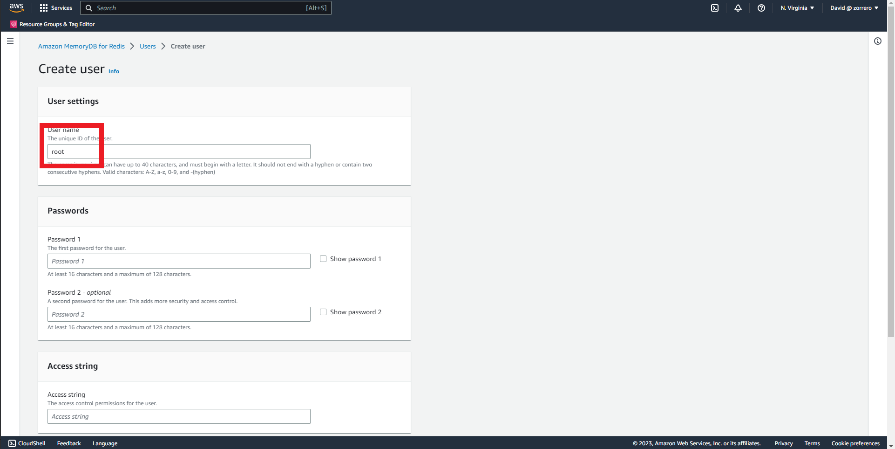
16. Use any password compliant with the policy 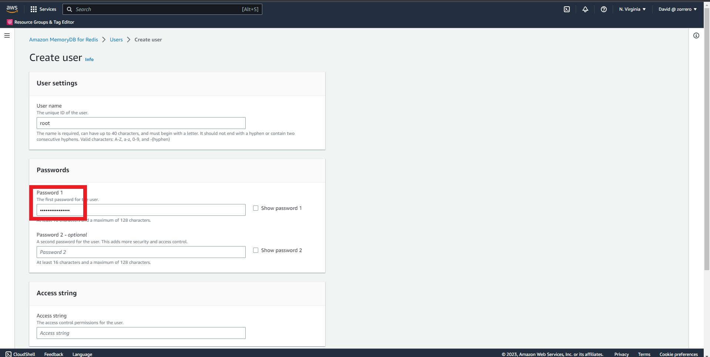
17. Give full permissions on Access string 
18. Click on "Create" 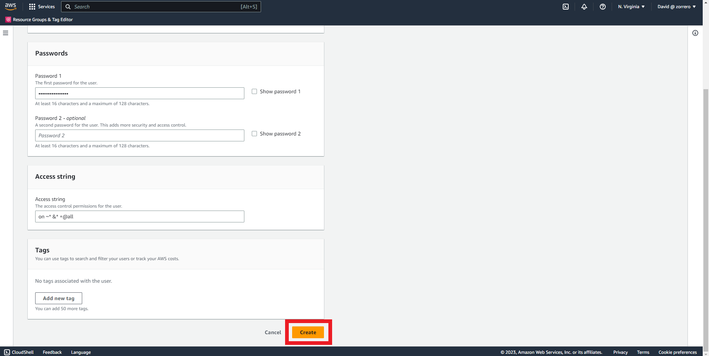
19. Go back to your ACL creation wizard and click on "Manage" 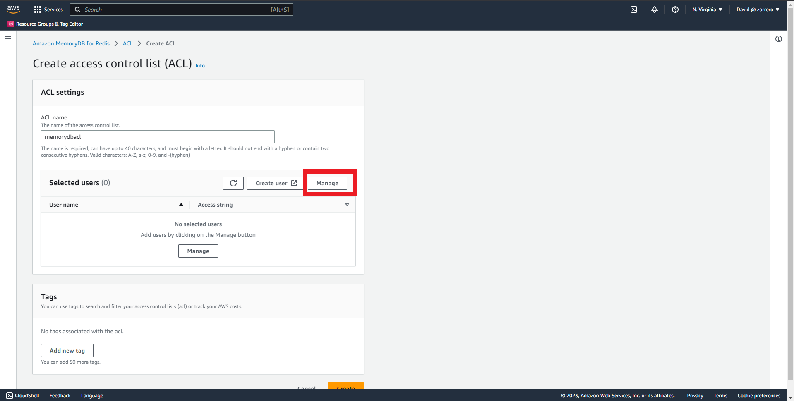
20. Choose the root user 
21. Click on "Create" 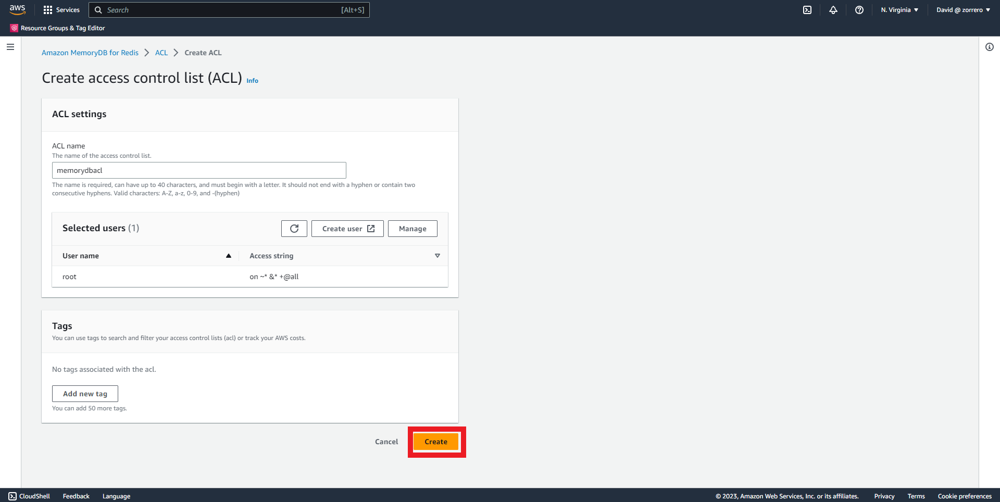
22. Go back to your MemoryDB creation wizard and click on reload ACL 
23. Select your created ACL 
24. Leave rest as default and click on "Next" 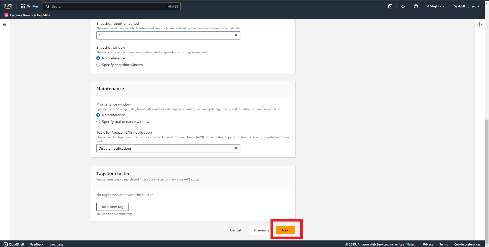
25. Click on "Create" 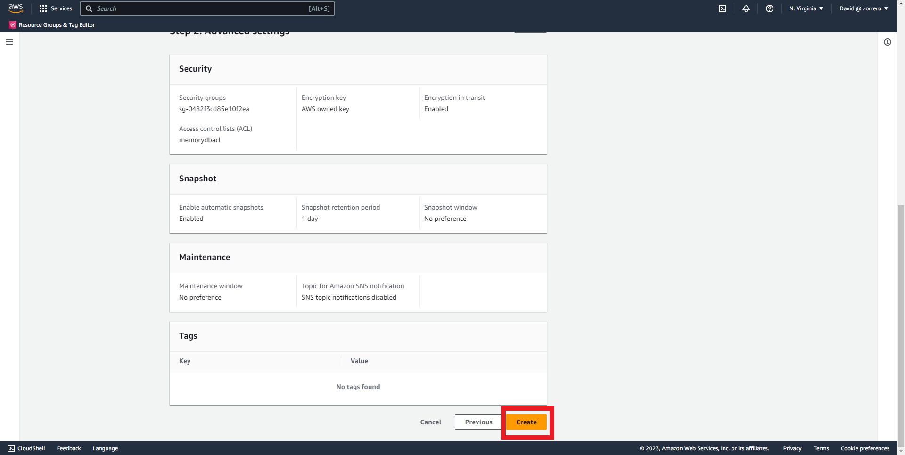