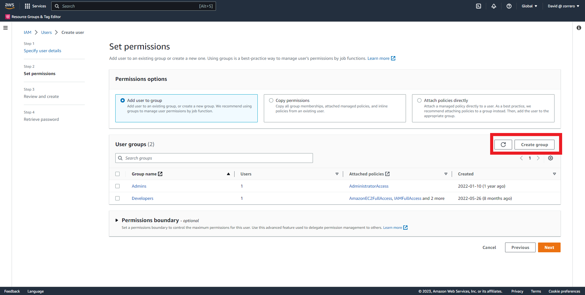

## IAM AWS - Create an IAM User and User Group

### Solution

This solution is provided using AWS Console and Terraform

1. Enter IAM to the Users page and click on Add Users button  
2. Fill User name 
3. Provide access to AWS Management Console, it will recommend to user Identity center, in this case use IAM User and autogenerated password 
4. Click on next and then on Create Group 
5. Fill the group name and policies, in this case AdministratorAccess 
6. Click on Create User Group and select it 
7. Click on next and then after review on Create User 
8. User will be created, click on show to view the password