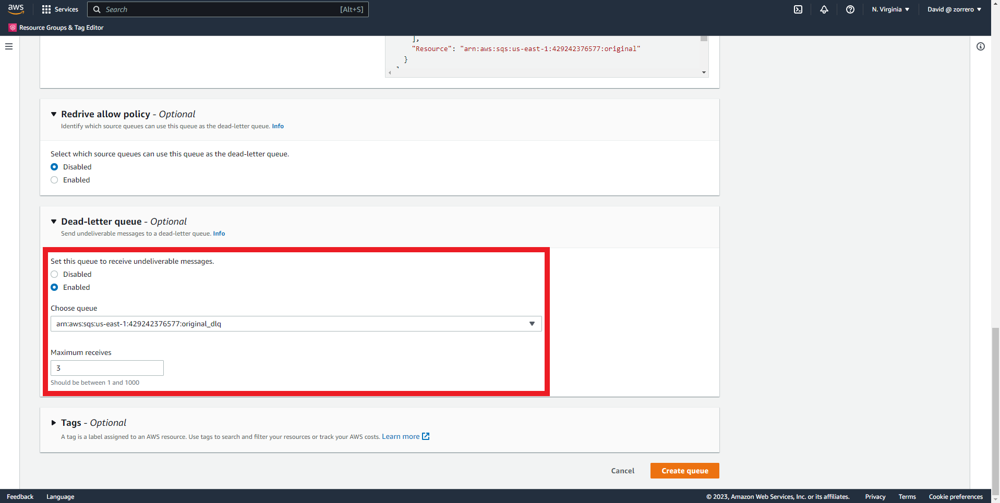

## Messaging AWS - Create a SNS topic with a subscription to SQS and a DLQ

### Solution

1. Enter SQS dashboard and click on "Create Queue" 
2. As this will be the DLQ the name will be "original_dlq" 
3. Scroll down and enter the values given 
   1. Message retention 14 days
   2. The rest remains as default
4. Leave the rest by default and click on "Create Queue" 
5. Go back to SQS dashboard and click on "Create Queue" again 
6. This will be the queue subscribed to the SNS, so the name will be "original" 
7. Scroll down and enter the values given 
   1. Default visibility timeout of 60 seconds
   2. Message retention of 6 hours
   3. Maximum message size of 48 KB
   4. Long polling of 20 seconds
   5. No delivery delay
8. In Dead letter queue configuration add the previously created queue and 3 receives 
9. Click on "Create Queue" 
10. Go to the dlq created and click on "Edit" 
11. Scroll down to Redrive Allow Policy, enable and select the original queue as origin 
12. Click on "Save" 
13. Go to SNS Dashboard and click on "Topics" 
14. Click on "Create Topic" 
15. Set the type as "Standard" and the name 
16. Leave everything as default and click on "Create topic" 
17. Click on "Create subscription" 
18. Select "Amazon SQS" as protocol and the "original" queue as endpoint 
19. Click on "Create subscription" 
20. Go to SQS and edit "original" queue, then go to access policy and add permissions to the SNS topic to send messages 
21. Click on "Save" 