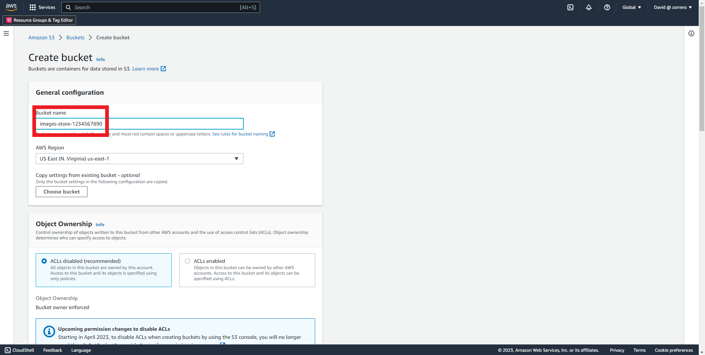
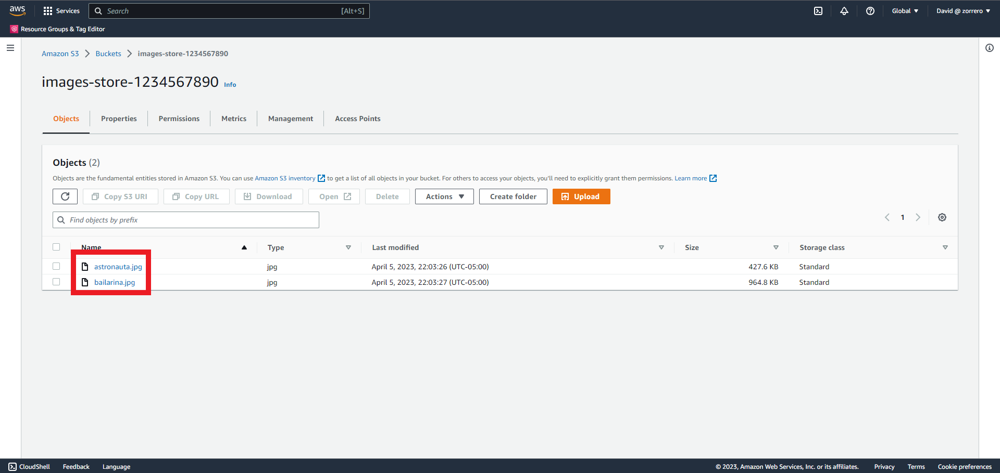
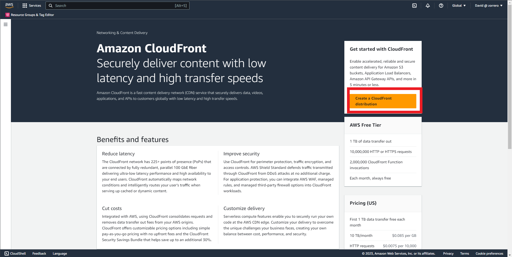
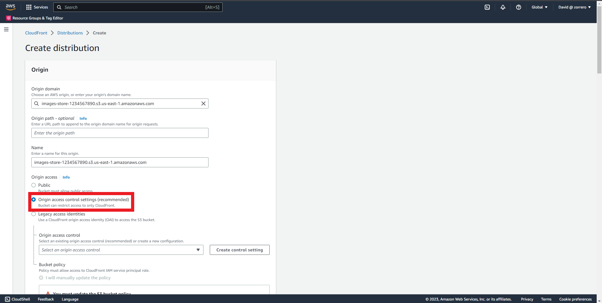
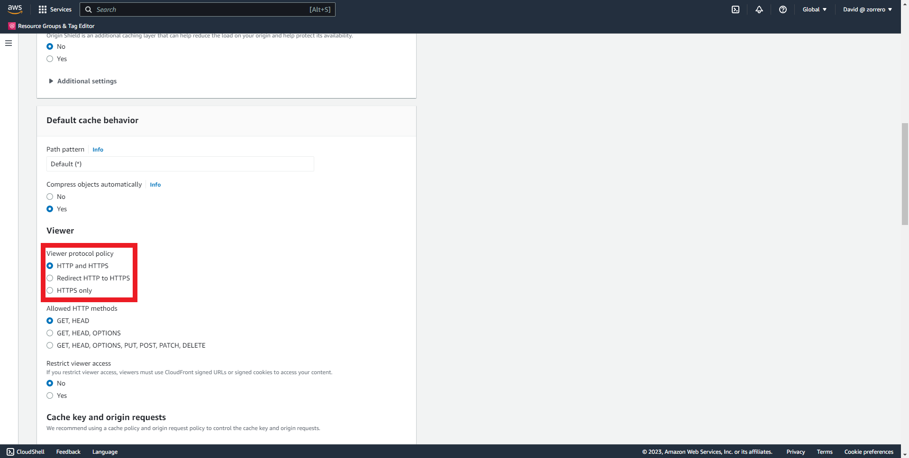
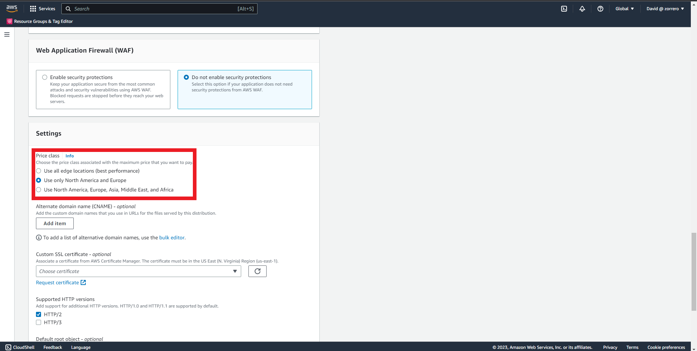
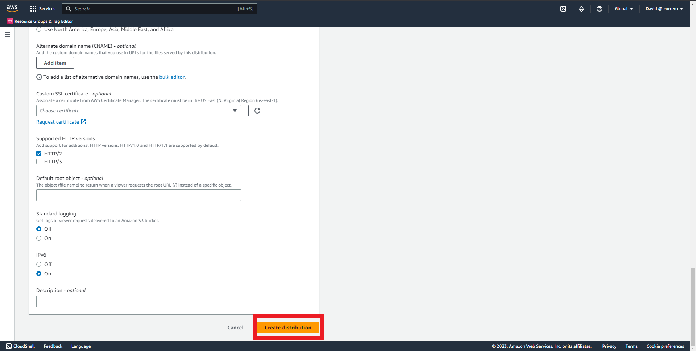
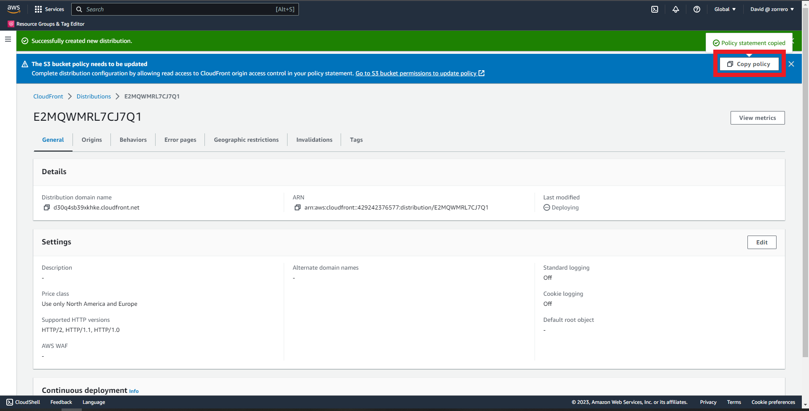
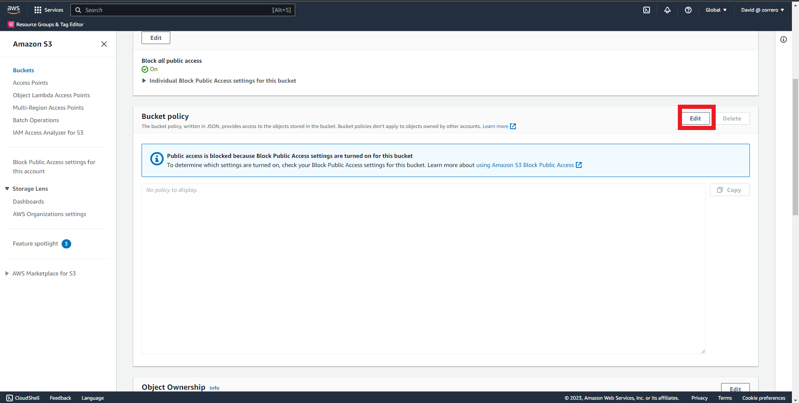

## Cloudfront - Create a Cloudfront distribution with OAC in S3 origin

### Solution

1. Go to S3 dashboard and click on "Create bucket" 
2. Fill the name space with the name of the bucket, remember it must be unique 
3. Click on "Create bucket" 
4. Upload the images to the bucket 
5. Go to CloudFront dashboard and click on "Create a CloudFront distribution" 
6. Choose your bucket with images as the OriginDomain 
7. Select Origin access control settings as the Origin access 
8. Click on "Create control setting" 
9. Leave default and click on "Create" 
10. In viewer protocol policy select "Redirect HTTP to HTTPS" 
11. On WAF click on "Do not enable security protections" 
12. On price class select "Use only North America and Europe" 
13. Leave others as default and click on "Create distribution" 
14. Click on "Copy policy" 
15. Go to your bucket and click on "Permissions" 
16. Go to Bucket policy and click on "Edit" 
17. Paste the policy copied and click on "Save changes" 