## Cloudfront - Create a static website in S3 and put it behind Cloudfront

### Solution

1. Go to S3 dashboard and click on "Create Bucket" 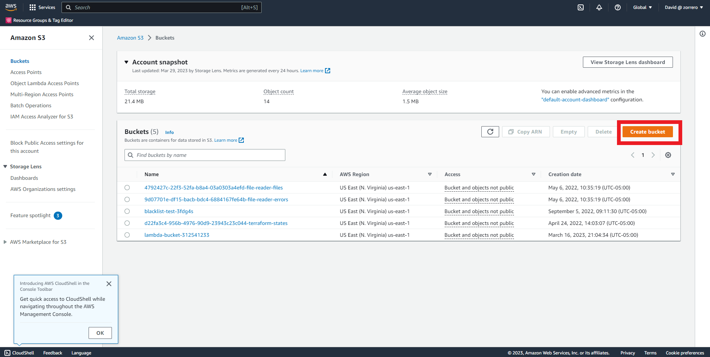
2. Configure the bucket name 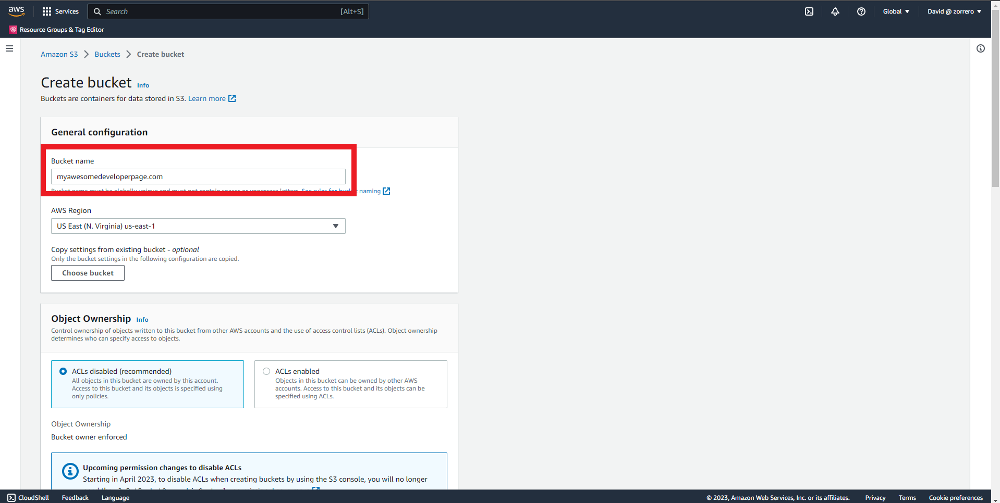
3. In the Block Public Access settings uncheck all the marks and check the acknowledgement 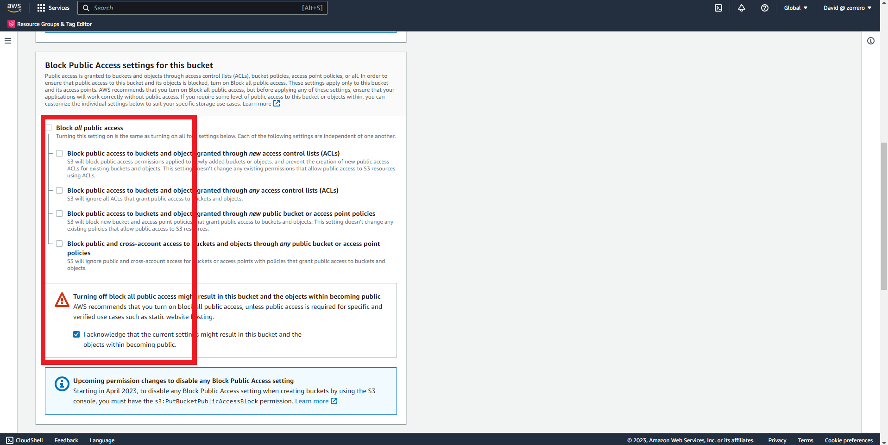
4. Leave other options as default and click on "Create Bucket" 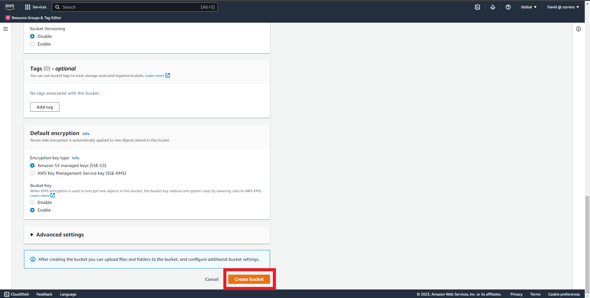
5. In the bucket objects upload the files for the website 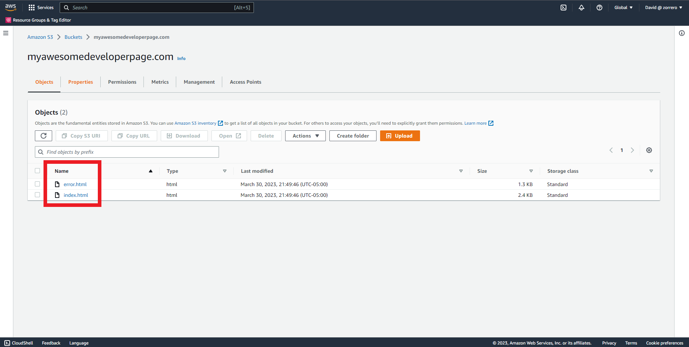
6. Go to properties 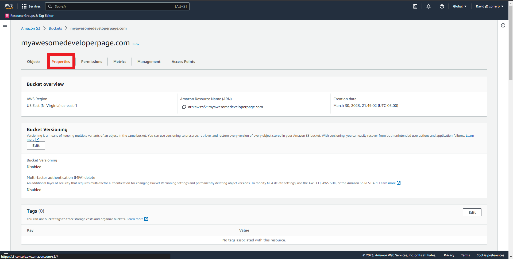
7. Scroll down and click on "Edit" in the Static website hosting zone 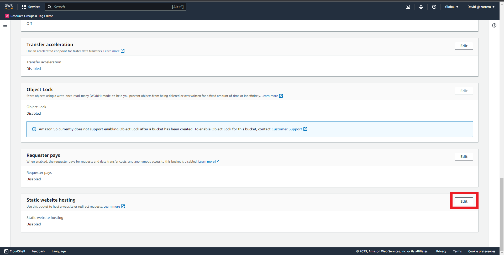
8. Enable the feature 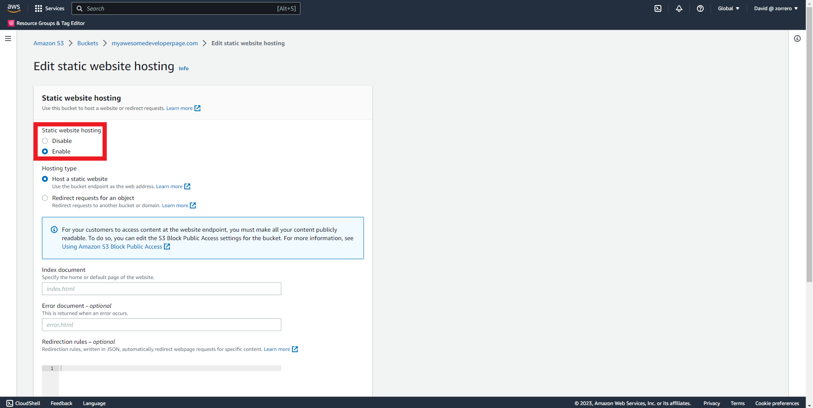
9. Specify names of your files and click on "Save changes" 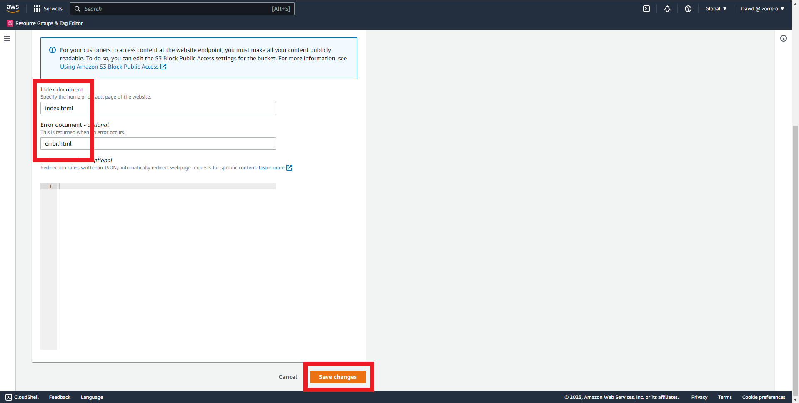
10. Go to "Permissions" 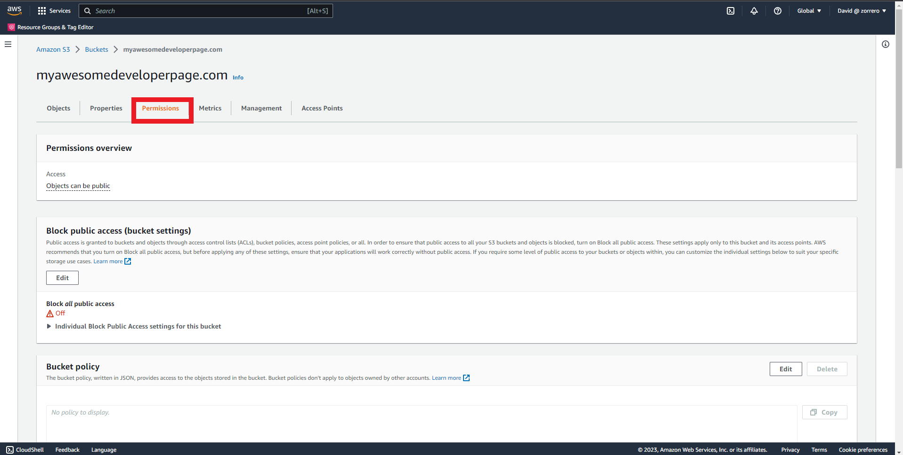
11. There are two ways to provide public access, one is Bucket Policy and the other is using ACL, for this solution I'm using Bucket Policy as ACL are legacy, click on "Edit" in Bucket policy area 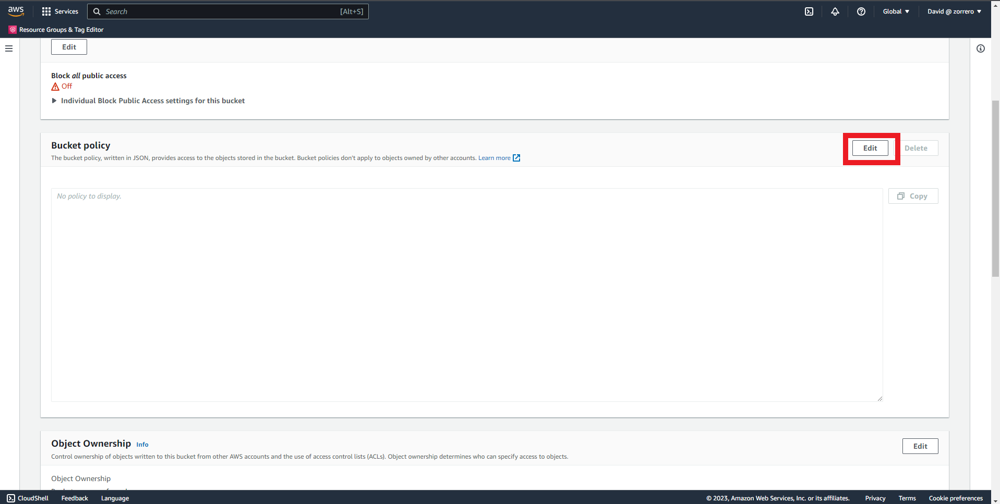
12. Add a policy that allows GetObject from any principal 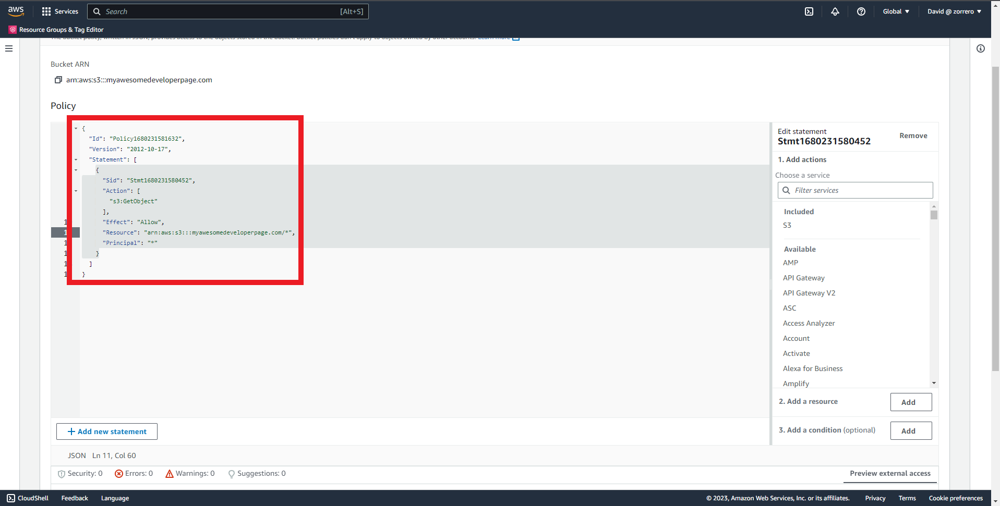
13. Click on "Save changes" 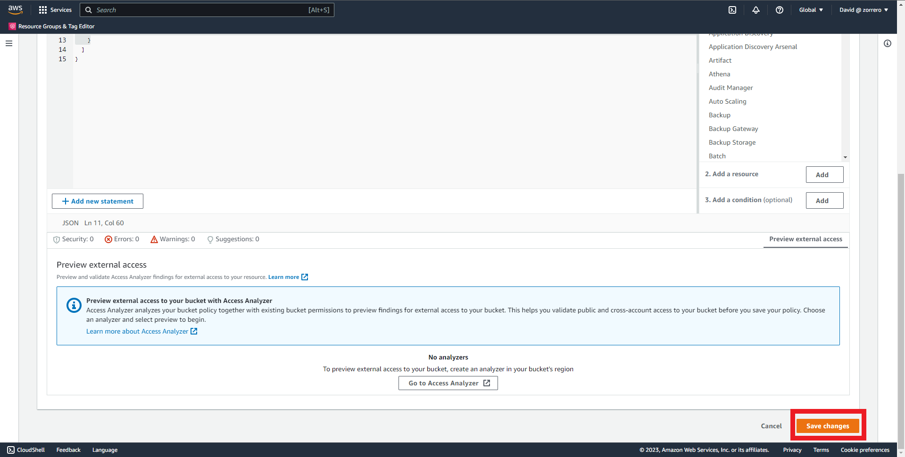
14. Go to Cloudfront dashboard and click on "Create a CloudFront distribution" 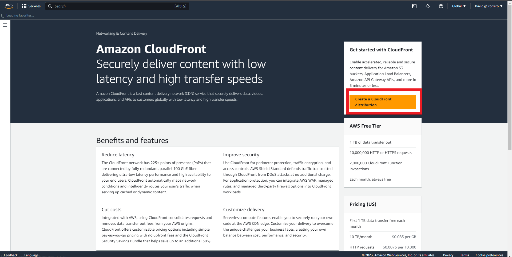
15. In "Origin domain" select your bucket 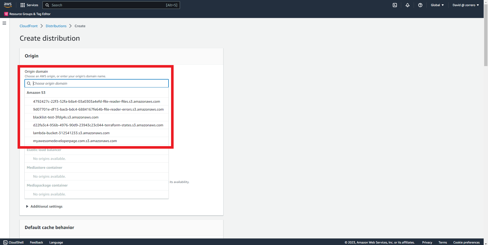
16. It will advise you to use Website endpoint, select it 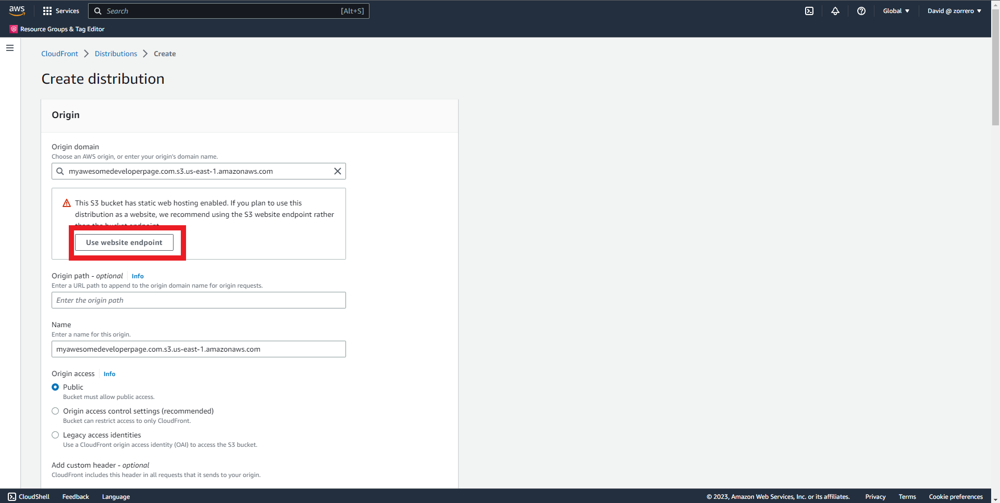
17. In viewer protocol policy select "Redirect HTTP to HTTPS" 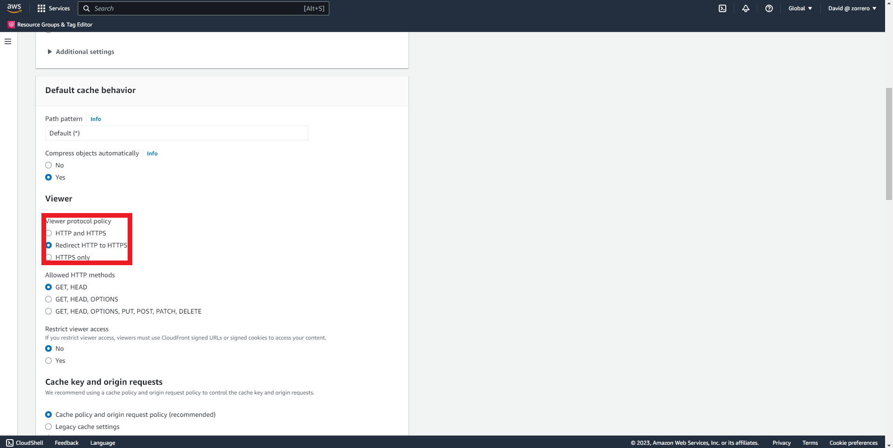
18. In WAF options select "Do not enable security options" 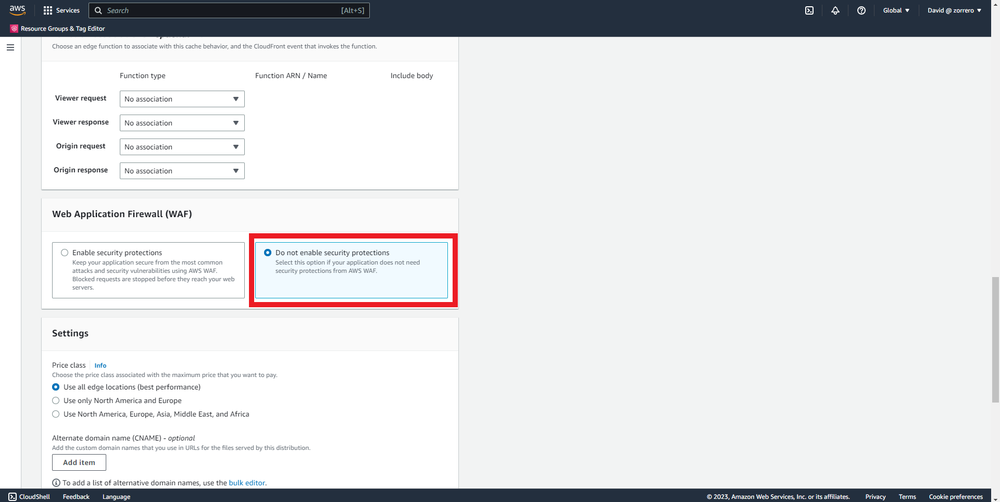
19. Leaver everything as default and select "Create distribution" 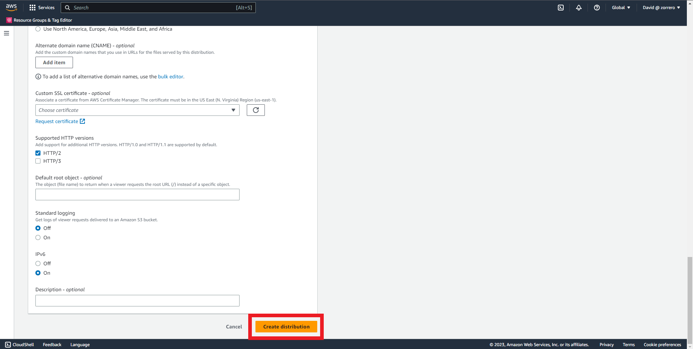