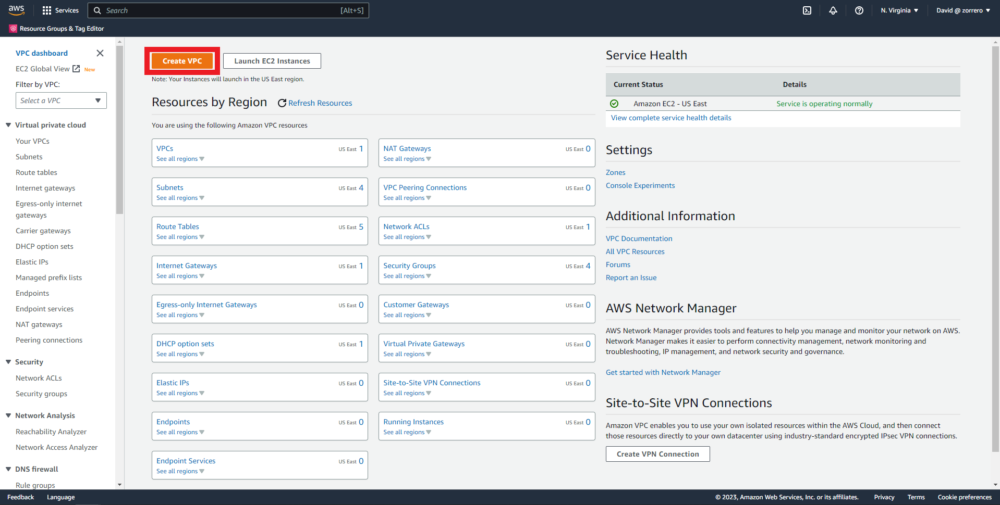
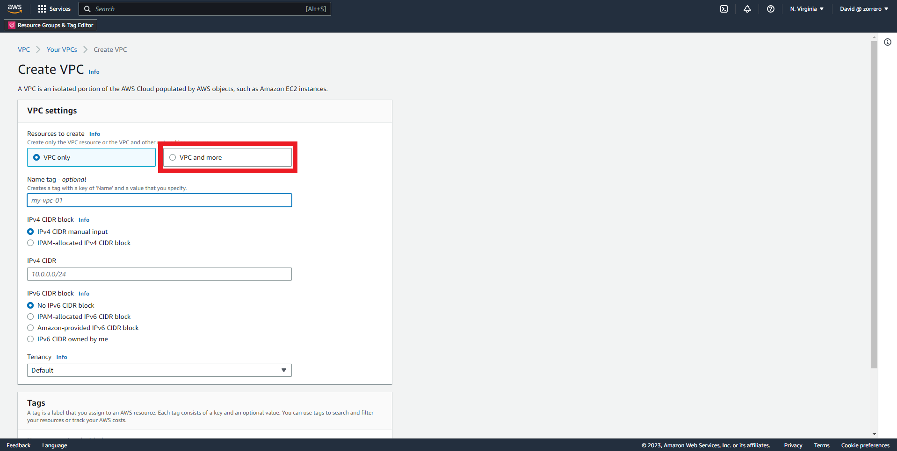
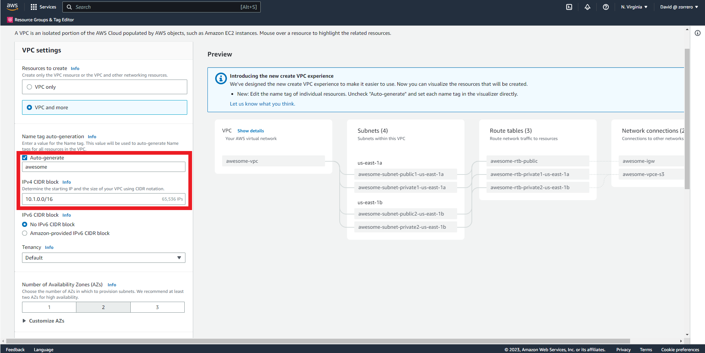
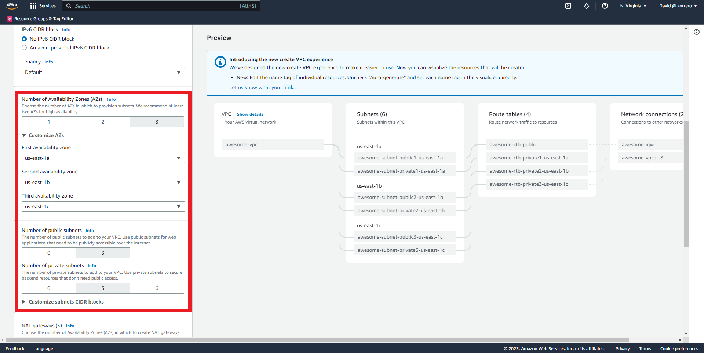
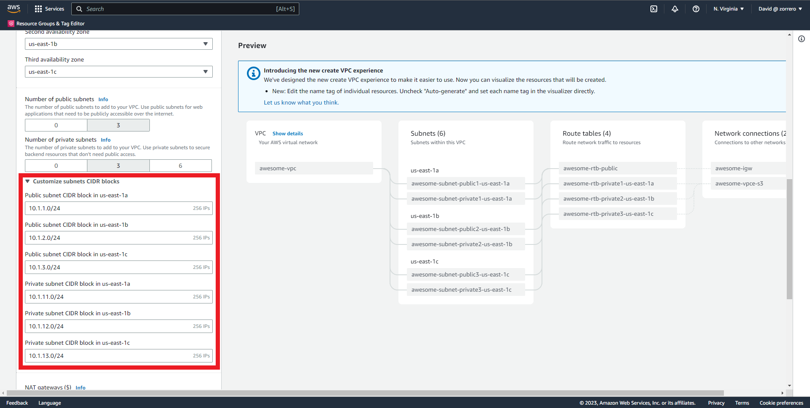
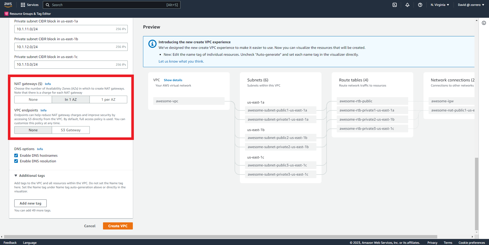

## VPC AWS - Create a VPC

### Solution

This solution is provided using AWS Console, Terraform and Pulumi, North Virginia (us-east-1) will be used

1. Enter to VPC and click on Create VPC button 
2. Select VPC and more option 
3. Fill the VPC name and change the CIDR block to 10.1.0.0/16 
4. Check the number of Availability Zones (AZ) to 3, then, mark 3 public subnets and 3 private subnets 
5. Open the Customize CIDR blocks option and fill with the requested values 
6. In NAT Gateways mark In 1 AZ and check None for VPC endpoints, then Create VPC 