## S3 AWS - Create a bucket with intelligent tiering and lifecycle policies

### Solution

This solution is provided using AWS Console and Terraform, North Virginia (us-east-1) will be used

1. Enter S3 dashboard and click on create bucket 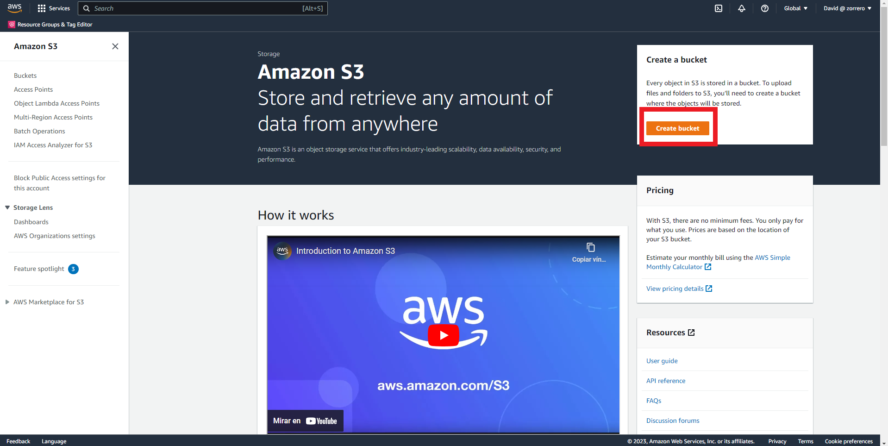
2. Fill the name and set ACLs disabled 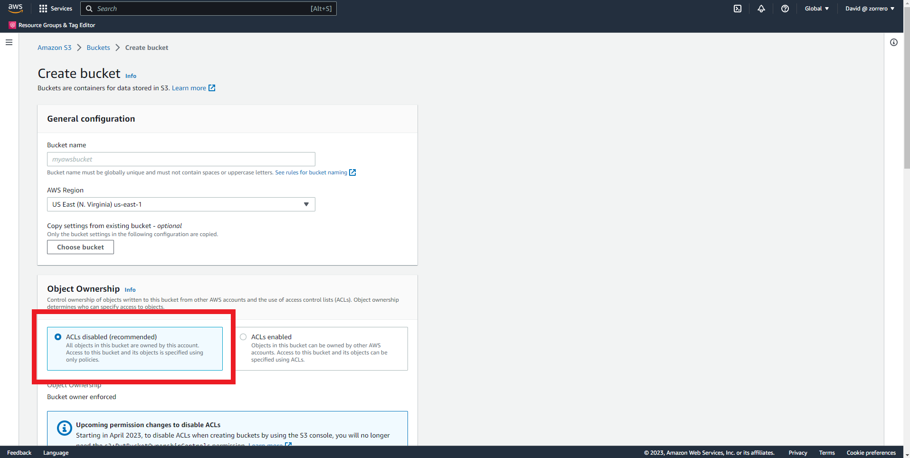
3. Leave block all public access enabled 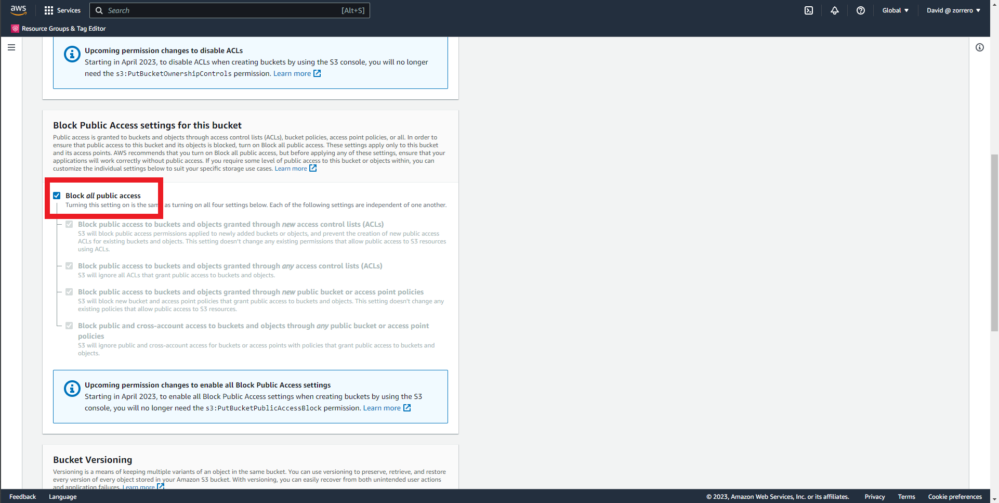
4. Enable versioning 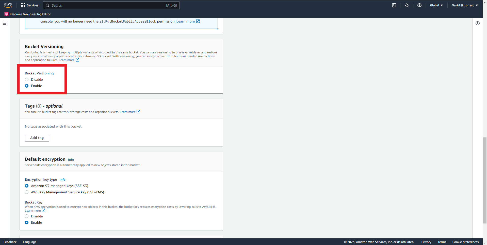
5. Click on create bucket 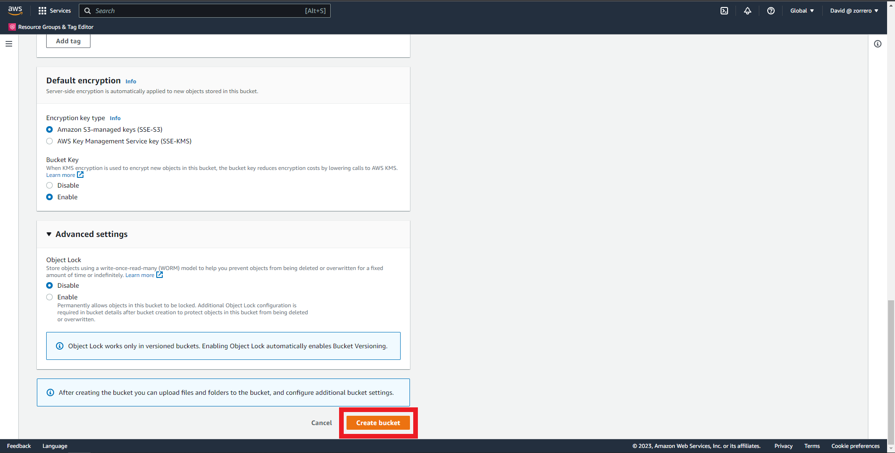
6. Enter the created bucket and click on properties 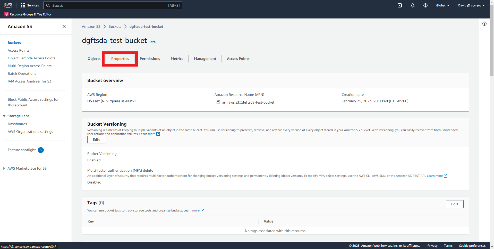
7. Scroll down until you find Intelligent-Tiering Archive configurations and click on Create Configuration 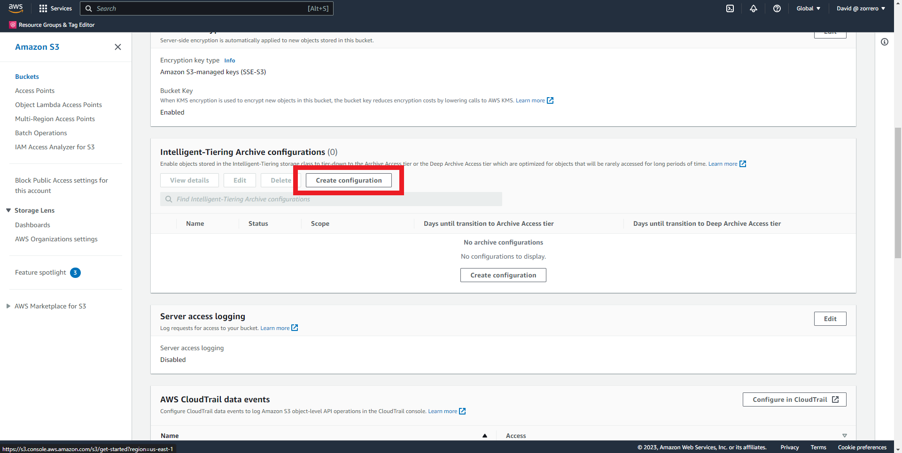
8. Fill the prefix with "apply-policy/" 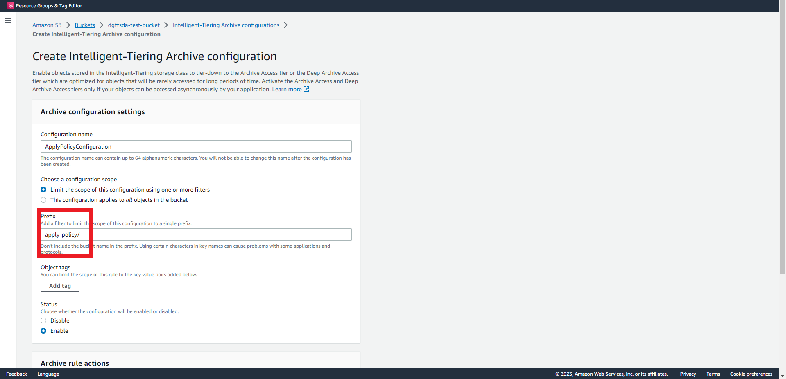
9. Activate the Archive Access Tier option and set the value to 90 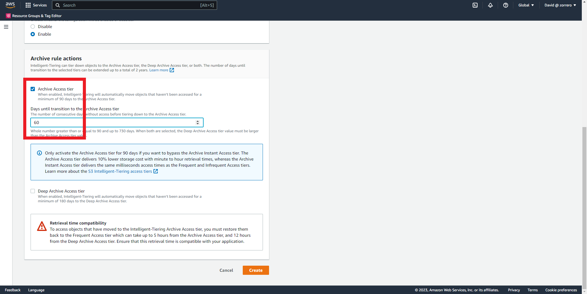
10. Activate the Deep Archive Access Tier option and set the value to 180 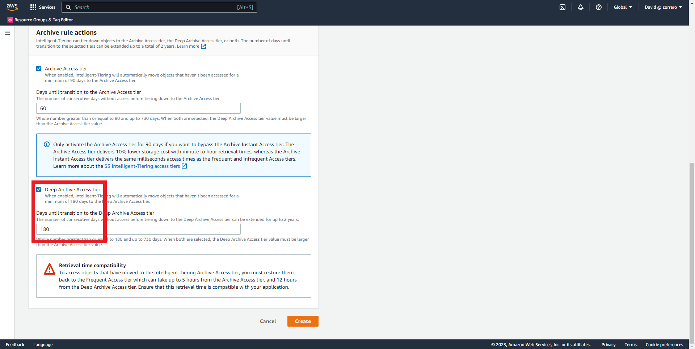
11. Click on create 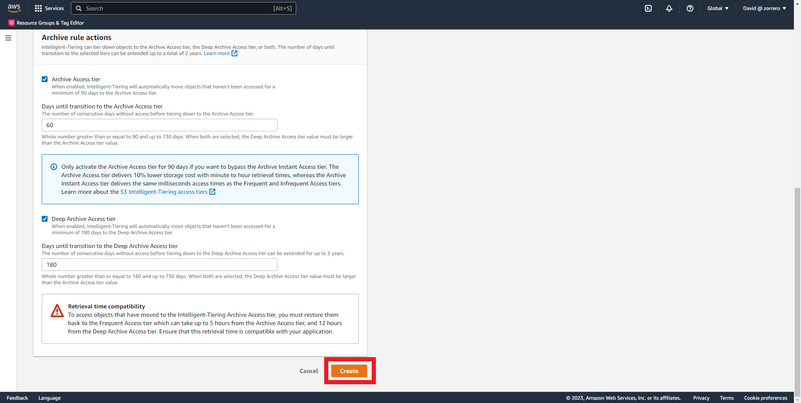
12. Return to the bucket and go to management 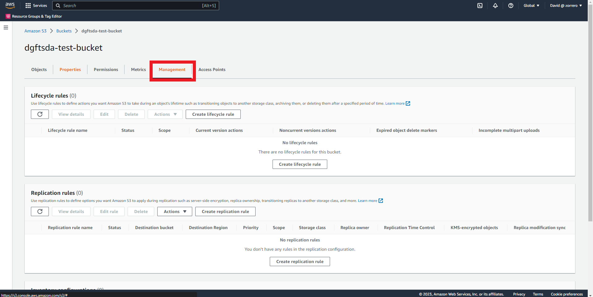
13. Click on create lifecycle rule, fill the prefix with "apply-policy/" 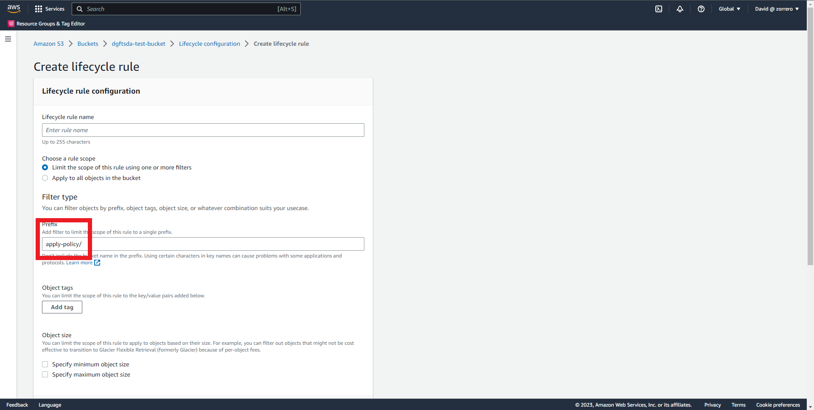
14. In lifecycle rule actions select "Move current versions of objects between storage classes" 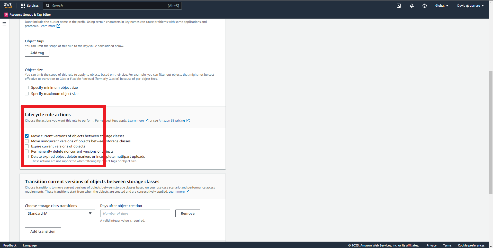
15. For Standard-IA fill with 30 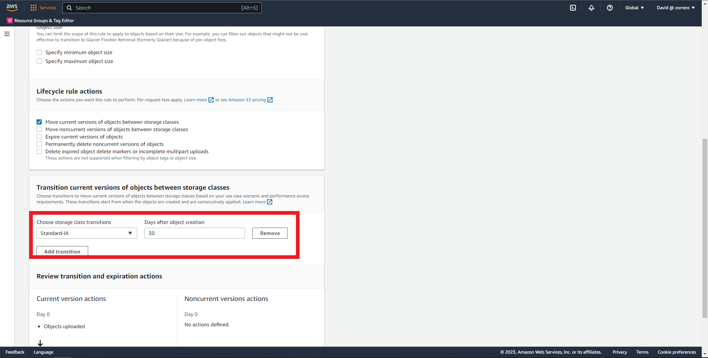
16. Click on Add Transition and select Intelligent-Tiering, fill with 60 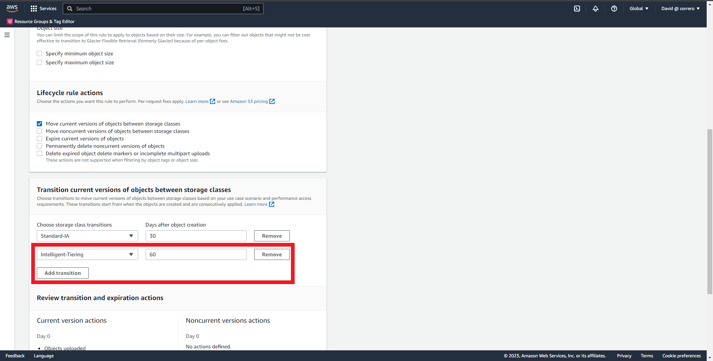
17. Click on create rule 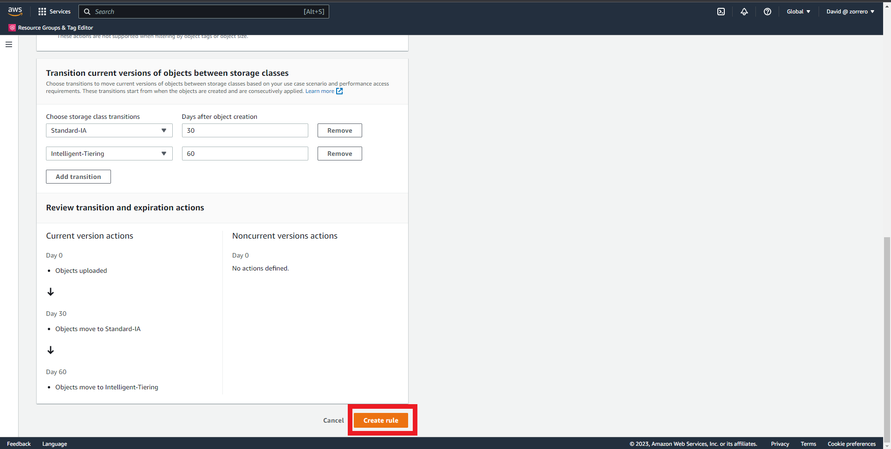